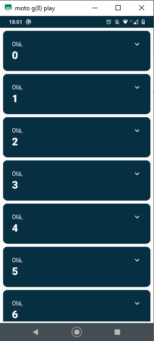
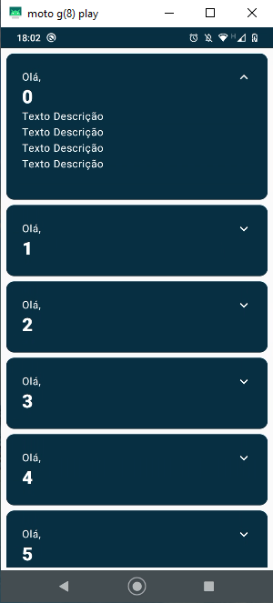
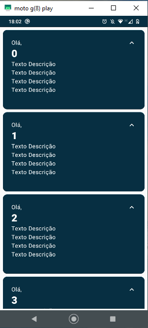

<h1 align="center">Codelab Jetpack Compose Básico Google Developer</h1>

  
  
   
  
  
  

⭐ Esse é um projeto de estudo onde fiz o Codelab do Google Developers de Jetpack Compose Básico.

📐 Dando os primeiros passos em Jetpack Compose.

